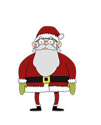

Santa can be found in multiple locations like the Castle Approach and the Entry.

You'll first meet him outside in the Castle Approach:
* Hello and welcome to the North Pole!
* We’re super excited about this year’s KringleCon 3: French Hens.
* My elves have been working all year to upgrade the castle.
* It was a HUGE construction project, and we’ve nearly completed it.
* Please pardon the remaining construction dust around the castle and enjoy yourselves!

Speak to him when you just enter the castle:
* Welcome to my newly upgraded castle!
* Also, check out that big portrait behind me!
* I received it in the mail a couple of weeks ago – a wonderful house warming present from an anonymous admirer.
* Gosh, I wonder who sent it. I’m so thankful for the gift!
* Please feel free to explore my upgraded castle and enjoy the KringleCon talks upstairs.
* You can get there through my new Santavator!

On the balcony after you won:
* Thank you for foiling Jack’s foul plot!
* He sent that magical portrait so he could become me and destroy the holidays!
* Due to your incredible work, you have set everything right and saved the holiday season!
* Congratulations on a job well done!
* Ho Ho Ho!

Santa