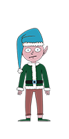

Sparkle Redberry can be found in front of the Santavator in the lobby and will provide a hint for objective 4

Sparkle's opening dialogue
* Hey hey, Sparkle Redberry here!
* The Santavator is on the fritz. Something with the wiring is grinchy, but maybe you can rig something up?
* Here's the key! Good luck!
* On another note, I heard Santa say that he was thinking of canceling KringleCon this year!
* At first, I thought it was a joke, but he seemed serious. I’m glad he changed his mind.
* Have you had a chance to look at the Santavator yet?
* With that key, you can look under the panel and see the Super Santavator Sparkle Stream (S4).
* To get to different floors, you'll need to power the various colored receivers.
* ... There MAY be a way to bypass the S4 stream.

Sparkle Redberry