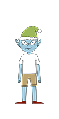

Wunorse Openslae can be found in the NetWars room and will provide a hint for objective 7 if you can help them out with their terminal "Can-Bus investigation".

Wunorse's opening dialogue
* Hiya hiya - I'm Wunorse Openslae!
* I've been playing a bit with CAN bus. Are you a car hacker?
* I'd love it if you could take a look at this terminal for me.
* I'm trying to figure out what the unlock code is in this CAN bus log.
* When it was grabbing this traffic, I locked, unlocked, and locked the doors one more time.
* It ought to be a simple matter of just filtering out the noise until we get down to those three actions.
* Need more of a nudge? Check out Chris Elgee's [talk](https://www.youtube.com/watch?v=96u-uHRBI0I) on CAN traffic!

After completing the terminal, Wunorse will provide a hint for objective 7:
* Great work! You found the code!
* I wonder if I can use this knowledge to work out some kind of universal unlocker...
* ... to be used only with permission, of course!
* Say, do you have any thoughts on what might fix Santa's sleigh?
* Turns out: Santa's sleigh uses a variation of CAN bus that we call CAN-D bus.
* And there's something naughty going on in that CAN-D bus.
* The brakes seem to shudder when I put some pressure on them, and the doors are acting oddly.
* I'm pretty sure we need to filter out naughty CAN-D-ID codes.
* There might even be some valid IDs with invalid data bytes.
* For security reasons, only Santa is allowed access to the sled and its CAN-D bus.
* I'll hit him up next time he's nearby.

Wunorse Openslae